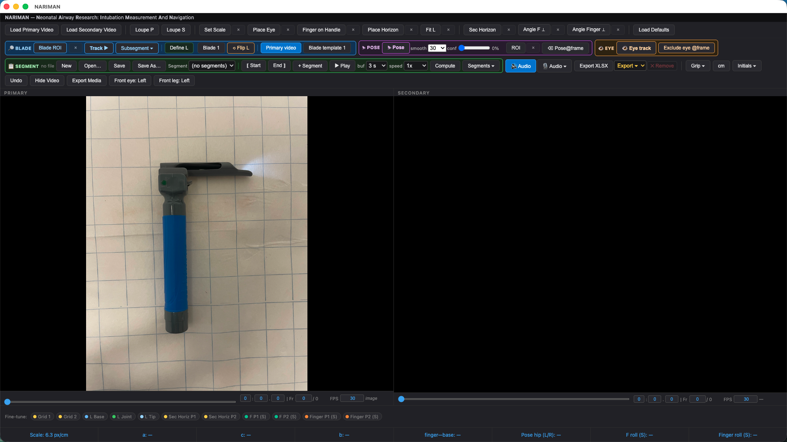

# NARIMAN

**Neonatal Airway Research: Intubation Measurement And Navigation**

[](LICENSE)
[](docs/NARIMAN_User_Manual.pdf)
[](THIRD_PARTY.md)
[](THIRD_PARTY.md)
[](https://ali-mahzarnia.github.io/nariman/)

**[Live site & screenshots →](https://ali-mahzarnia.github.io/nariman/)** · **[User Manual (PDF) →](docs/NARIMAN_User_Manual.pdf)**



NARIMAN is a cross-platform desktop application for frame-by-frame
measurement of neonatal intubation video. Load two synchronized camera
views, calibrate a laryngoscope blade once, place a handful of reference
points, and it computes a full set of clinical angles, distances, and
range-of-motion statistics — calibrated to real-world centimeters or inches
— and exports everything to Excel, one row per trial.

It is AI-assisted throughout, on three on-device models: automatic **pose
tracking**, automatic **blade tracking**, an **eye tracker** that follows the
operator's head from the pose model's own face landmarks, and fully offline
**speech transcription** of the session's audio. All four run locally, on
plain CPU — no GPU, no specialized hardware, and nothing to configure.
Nothing is uploaded anywhere, no account or internet connection is
required, ever, and every frame stays on your machine.

---

## What it measures

**Primary view**

- **Handle-to-Horizon angle (a)** — the laryngoscope handle's angle from a
  level line, signed so you can tell which way it leans.
- **Eye-to-Joint distance (b)** — from the operator's eye to the blade's
  bend point.
- **Eye-to-Horizon angle (c)** — the eye-to-joint line against the level
  line.
- **Finger-to-Base distance** — along the blade's own axis, to wherever the
  protocol calls for the finger point.
- **Hip angle, left and right**, and its range of motion across a marked
  segment, from automatic pose tracking.

**Secondary view** (an optional second, front-facing camera)

- **Blade F Roll** — how far the blade has rolled about its own axis.
- **Finger Roll** — the angle of the operator's grip.
- Its own independent horizon line to measure both against.

A live readout strip shows all of these at once, updating as you move a
point, scrub a frame, or run the automatic trackers.

---

## Full feature list

- **Blade Templates & calibration.** Four blade slots (three pre-calibrated,
  one fully custom) captured with a five-click **Define L** sequence from a
  reference photo on a known grid. **Fit L** then drops that real-world
  shape onto any study frame — click, drag, scroll to rotate, resize, flip
  — and **Set Scale** converts the frame's pixels to centimeters from any
  known real-world distance.
- **Reference points** — Place Eye, Finger on Handle, Place Horizon — each
  a click-and-place tool, individually fine-tunable with the keyboard.
- **Secondary view rotation angles** — Sec Horizon, Angle F, Angle Finger —
  independent of the primary view, for rotation the side camera can't see.
- **Automated tracking (Pose, Blade, Eye).** An on-device tracker finds
  shoulders, hips, knees, and eyes and draws both hip angles automatically;
  a second on-device tracker follows the blade itself frame by frame and
  drives the fitted blade shape; a third ties a marker to the operator's
  eye and follows the head as it moves. A drawable Region of Interest keeps
  tracking confined to the right person in frame.
- **Segments & range-of-motion analysis.** Mark a start and end frame,
  Compute a full pass, and get min / max / ROM / mean / median for hip
  angle, plus blade-angle and eye-angle statistics over an optional
  subsegment. Low-confidence frames are auto-flagged and can be excluded
  with one click, recalculating stats instantly.
- **Session files.** Everything about a subject — segments, excluded
  frames, export checkpoints, the Region of Interest, the audio
  transcript, and the full calibration — lives in one portable,
  human-readable JSON file, roughly 300 KB per hour of video. A one-click
  **Load Defaults** gives a fast-start calibration for a brand-new subject.
- **Audio playback & AI speech transcription.** Fully offline speech-to-text
  with word-level timestamps, adjustable speech sensitivity, searchable
  transcript with instant jump-to-timecode, and on-screen closed captions
  during playback.
- **Export.** One Excel workbook, one worksheet per subject, one row per
  trial — single-frame measures plus every segment, blade, and eye
  statistic. PNG screenshots or MP4/WebM segment video, with an optional
  Hide Video mode that keeps every overlay but blacks out the underlying
  footage. Every export is bookmarked and can be jumped back to.
- **Grip style & operator initials**, undo (up to 50 steps of calibration
  history), and a full keyboard-shortcut set for fast, precise, mouse-light
  operation.

---

## Install and run

Prebuilt macOS and Windows builds are the intended way most users will run
NARIMAN — see the [User Manual](docs/NARIMAN_User_Manual.pdf) chapter 2 for
platform-specific install steps once a release is published.

To run from source:

```bash
git clone https://github.com/Ali-Mahzarnia/nariman.git
cd nariman
npm install
npm start
```

No account, license key, or internet connection is required — including
for the AI features.

---

## Building a distributable

```bash
npm run dist
```

packages the app with `electron-builder` for macOS (universal) and Windows
(x64 / ia32). The on-device model weights and speech-recognition binary are
**not** included in this repository, because of their size and their own
licenses — see [THIRD_PARTY.md](THIRD_PARTY.md) for exactly what's used and
where to get it, and place the files under `resources/` yourself before
building:

```
resources/
  bin/
    mac-arm64/   ffmpeg   whisper
    mac-x64/     ffmpeg   whisper
    win-x64/     ffmpeg.exe   whisper.exe   (+ its DLLs)
    win-ia32/    ffmpeg.exe   whisper.exe   (+ its DLLs)
  models/
    <speech model>
    <blade-pose ONNX models>
```

---

## The session file

Every working session — segments, fine-tuned pose corrections, excluded
frames, export checkpoints, reference points, the Region of Interest, and
the audio transcript — saves automatically to a single lightweight JSON
file. Send it, plus the original video, to a collaborator and they get the
exact same session, ready to review, correct, or continue from where you
left off. Full schema in the manual's Appendix C.

---

## Documentation

The full [User Manual](docs/NARIMAN_User_Manual.pdf) covers every control,
every dialog, the complete keyboard shortcut list, the Excel column
reference, and the session-file JSON schema — written directly from the
running application.

---

## License

NARIMAN is licensed under the **GNU Affero General Public License v3.0**
(AGPL-3.0). See [LICENSE](LICENSE) for the full text.

This project builds on several third-party open-source components for
on-device inference and media handling. Full, honest attribution — names,
licenses, and exactly how each one is used — is in
[NOTICE](NOTICE) and [THIRD_PARTY.md](THIRD_PARTY.md).

The blade-pose keypoint model is trained with [Ultralytics
YOLO11](https://github.com/ultralytics/ultralytics) (AGPL-3.0). The final
exported weights ship in `resources/models/`, and the training pipeline that
produced them — code only, no training data — is published at
[`blade_pose_training/`](blade_pose_training/) as AGPL-3.0's Corresponding
Source.

---

## A note on data

The screenshot above shows the built-in blade-calibration reference photo
on a checkerboard test grid — no patient, subject, or clinical footage.
This repository contains only application code and documentation; no
recorded sessions, videos, or exported data are included.

---

## Citation

If you use NARIMAN in your research, please cite it:

> Mahzarnia, A. NARIMAN — Neonatal Airway Research: Intubation Measurement
> And Navigation. https://doi.org/10.5281/zenodo.21473369

---

## Questions & feedback

Bug reports, questions, and feedback are welcome — please [open an
issue](https://github.com/Ali-Mahzarnia/nariman/issues) on this repository.
